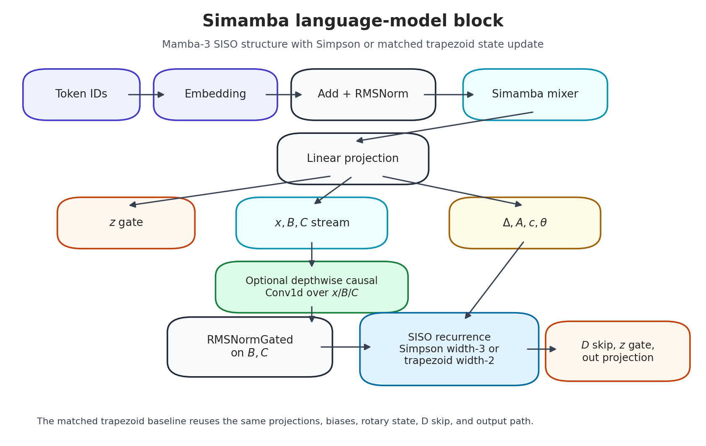
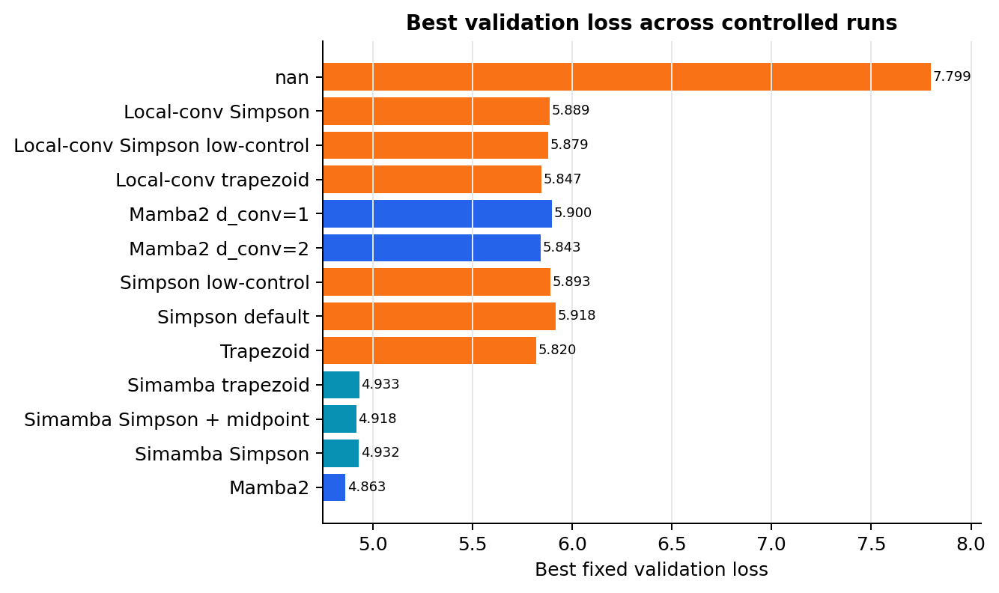
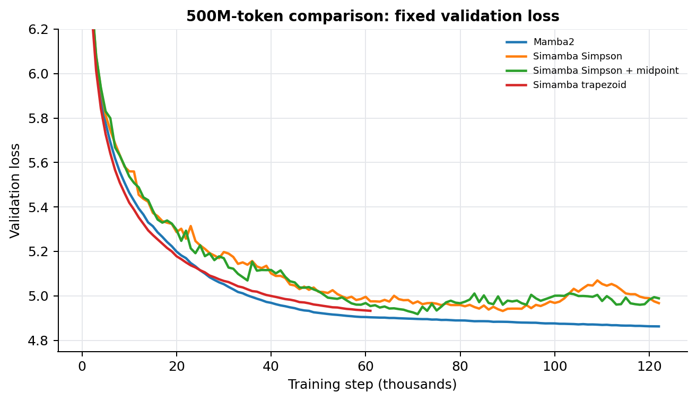
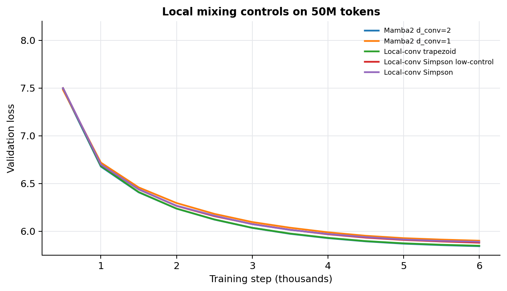
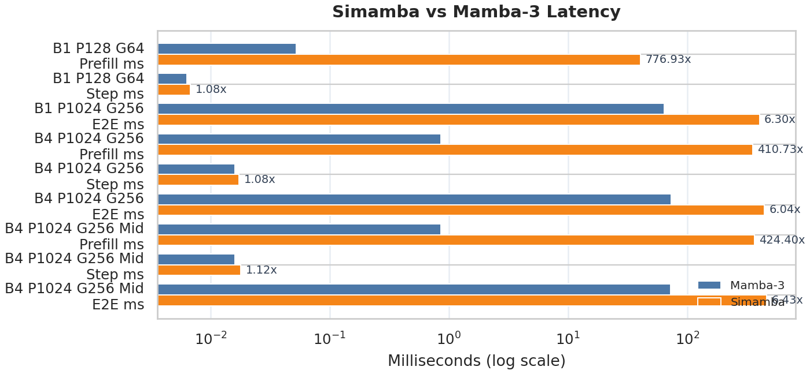

# HPML Final Project: Simamba

> **Course:** High Performance Machine Learning
> **Semester:** Spring 2026
> **Instructor:** Dr. Kaoutar El Maghraoui

---

## Team Information

- **Team Name:** Simamba
- **Members:**
  - Soumil Baldota (ssb2234) - Simamba implementation, training pipeline, W&B/checkpointing, experiments, and artifact generation
  - Ansen Shia (as8008) - experiment design, analysis, report, and presentation
  - David Zhang (dwz2107) - baselines, result analysis, report, and presentation

## Submission

- **GitHub repository:** [https://github.com/hpmls26/simamba](https://github.com/hpmls26/simamba)
- **Final report source:** [`docs/paper.tex`](docs/paper.tex) and extended experiment report [`docs/hpml_simamba_report.md`](docs/hpml_simamba_report.md)
- **Final deliverables:** compiled report and presentation files under [`deliverables/`](deliverables/)
- **Final presentation materials:** slide-ready figures and tables under [`docs/assets/paper/`](docs/assets/paper/)
- **Experiment-tracking dashboard:** [Weights & Biases project](https://wandb.ai/ssb2234-columbia/simamba)
- **Exported checkpoints:** [Simamba midpoint 10M](https://huggingface.co/soumil1/simamba-midpoint-10m-slimpajama-500m) and [Mamba2 10M](https://huggingface.co/soumil1/mamba2-10m-slimpajama-500m)

This workspace contains the report source, generated paper assets, reproducibility scripts, and the expected `deliverables/` location for the final compiled report and presentation submitted to CourseWorks.

---

## 1. Problem Statement

This project evaluates whether a Simpson-style discretization can improve the SISO state recurrence used by Mamba-3-style language-model mixers. The target workload is language-model training on SlimPajama, with supporting inference/kernel benchmarking to understand whether the new recurrence is practical. The main bottlenecks are optimization stability in recurrent SSM dynamics and GPU efficiency, especially prefill throughput and memory traffic in the current Simamba implementation.

---

## 2. Model/Application Description

- **Model architecture:** `MambaLMHeadModel` with 10M-parameter Mamba-family mixers. The controlled shape is `d_model=160`, `n_layer=8`, `d_state=64`, `headdim=32`, `seq_len=128`, tied embeddings, RMSNorm, and a vocabulary size of 50,280.
- **Proposed layer:** `Simamba`, a Mamba-3-inspired SISO mixer that replaces the width-2 trapezoid update with a width-3 Simpson-style recurrence. It supports `--simamba-discretization {simpson,trapezoid}`, midpoint control, coefficient logit offsets, and optional Mamba2-style local convolution over the `x/B/C` stream.
- **Baselines:** Mamba2, matched Simamba trapezoid, Simamba Simpson default, Simamba Simpson low-control, Simamba midpoint, and local-conv variants.
- **Framework:** PyTorch, Triton, `mamba_ssm`, Hugging Face `transformers`, W&B, NumPy memmaps, and optional `causal-conv1d`.
- **Dataset:** `MBZUAI-LLM/SlimPajama-627B-DC`, streamed from Hugging Face and tokenized with `EleutherAI/gpt-neox-20b`. The dataset card reports an MIT license. Prepared subsets are `100M/10M` and `500M/50M` train/validation tokens.
- **Custom layers/modifications:** `mamba_ssm/modules/simamba.py`, `mamba_ssm/ops/triton/simamba/`, checkpoint metadata/resume logic, fixed validation sampling, no-replacement epoch training sampling, compression evaluation, local-conv controls, and benchmark/figure generation.
- **Hardware target:** Final controlled experiments ran on 1x NVIDIA Tesla V100-SXM2 16GB. The local validated environment was Linux, driver 550.90.07, CUDA 12.4, PyTorch 2.6.0+cu124, Triton 3.2.0, `transformers` 5.7.0, and `causal_conv1d` 1.6.0.



---

## 3. Final Results Summary

Lower validation loss is better. The central result is negative but reproducible: the current Simpson parameterization trains stably, but it does not beat the matched trapezoid baseline or Mamba2.

| Metric | Baseline | Simamba / Proposed Variant | Delta |
| --- | ---: | ---: | ---: |
| 500M-token best validation loss | Mamba2: 4.8625 | Simamba midpoint: 4.9178 | +0.0552 worse |
| 500M-token matched trapezoid validation loss | Simamba trapezoid: 4.9326 | Simamba default Simpson: 4.9319 best, 4.9671 final | best roughly tied; final worse |
| 50M-token matched discretization loss | Simamba trapezoid: 5.8195 | Simpson low-control: 5.8929 | +0.0734 worse |
| 50M-token local-conv discretization loss | Local-conv trapezoid: 5.8469 | Local-conv Simpson low-control: 5.8793 | +0.0324 worse |
| Training throughput, 500M tail median | Mamba2: 16,095 tok/s | Simamba midpoint: 12,594 tok/s | 21.7% lower |
| Decode-step latency, B4/P1024/G256 | Mamba-3: 0.0160 ms | Simamba: 0.0173 ms | 1.08x slower |
| Prefill latency, B4/P1024/G256 | Mamba-3: 0.8602 ms | Simamba: 353.3066 ms | 410.7x slower |
| Prefill peak memory, B4/P1024/G256 | Mamba-3: 167.3911 MB | Simamba: 124.2363 MB | 25.8% lower |
| Row-wise int8 QDQ loss delta | Mamba2: +0.0019 | Simamba midpoint: +0.0014 | both nearly lossless |
| Exported model size on disk | Mamba2 HF export: 40 MB | Simamba HF export: 40 MB | roughly equal |

**Hardware:** 1x NVIDIA Tesla V100-SXM2 16GB, CUDA 12.4, PyTorch 2.6.0+cu124, Triton 3.2.0, Debian Linux.

**Headline result:** Simamba produced a stable, reproducible SSM training pipeline, but the current Simpson recurrence did not outperform trapezoid: at 50M tokens, matched trapezoid reached 5.8195 validation loss while the best Simpson control reached 5.8929, and kernel benchmarking showed decode overhead was small but prefill was not yet competitive.

---

## 4. Repository Structure

```text
.
├── README.md                         # HPML submission README
├── README_upstream_mamba.md          # Upstream Mamba README
├── LICENSE                           # Apache-2.0
├── pyproject.toml / setup.py          # Package and optional dependency metadata
├── requirements.txt                   # Pinned reported Python environment
├── configs/                           # Reproduction configs for reported runs
├── src/README.md                      # Source-location map for HPML packaging
├── deliverables/                      # Final report/deck files for submission
├── docs/
│   ├── paper.tex                      # Final paper source
│   ├── hpml_simamba_report.md         # Extended run report used to complete this README
│   └── assets/paper/                  # Generated plots, CSV summaries, and architecture figure
├── mamba_ssm/
│   ├── modules/simamba.py             # Simamba mixer and local-conv/discretization controls
│   ├── modules/mamba2.py              # Mamba2 compatibility fixes and d_conv controls
│   └── ops/triton/simamba/            # Simamba SISO reference/Triton kernels
├── scripts/
│   ├── prepare_slimpajama.py          # Streaming tokenization into uint16 memmaps
│   ├── train_simamba_lm.py            # Main LM training/eval/checkpoint loop
│   ├── run_10m_discretization_comparison_500m.sh
│   ├── run_followup_ablation_50m_after_current.sh
│   ├── run_simamba_localconv_50m.sh
│   ├── train_state_tracking.py
│   ├── eval_checkpoint_compression.py
│   ├── generate_hpml_paper_assets.py
│   ├── convert_mamba2_checkpoint_to_vllm_hf.py
│   └── push_best_simamba_to_hf.py
├── benchmarks/
│   ├── benchmark_simamba_siso.py
│   ├── plot_simamba_benchmarks.py
│   └── plots/
├── profiling/
│   ├── run_all_profiling.py            # One-command final profiling pipeline
│   ├── nsys_kernel_profile.py          # Nsight Systems trace/export harness
│   ├── ncu_kernel_profile.py           # Nsight Compute filtered-kernel harness
│   ├── vllm_sweep.py                   # TTFT/TPOT/tok/s, GPU, prefill/decode profiling
│   ├── vllm_combine_results.py         # Combined vLLM tables and matplotlib plot
│   ├── kernel_correctness.py           # Triton-vs-PyTorch forward/backward checks
│   ├── simamba/ and mamba3/            # Standalone SISO kernel profilers
│   ├── test_kernel/                    # Improved fused Simamba prototype profiler
│   └── results/                        # Local profiling traces, CSVs, and plots
├── data/                              # Local prepared SlimPajama memmaps
├── outputs/                           # Local training checkpoints and metrics
├── hf_exports/                        # Local Hugging Face export directories
├── run_logs/                          # JSONL-style logs and evaluation summaries
└── wandb/                             # Local W&B run files
```

---

## 5. Reproducibility Instructions

### A. Environment Setup

```bash
# Clone
git clone git@github.com:hpmls26/simamba.git
cd simamba

# Create a clean Python environment
python3.10 -m venv .venv
source .venv/bin/activate
python -m pip install -U pip
python -m pip install -r requirements.txt

# Install this repo after the pinned runtime packages.
python -m pip install -e . --no-build-isolation

# Optional, for Mamba-3 benchmark dependencies:
python -m pip install -e '.[mamba3]' --no-build-isolation

# Optional, if a platform-specific vLLM fork is needed for native Simamba:
# install that fork after the base requirements.
```

**System requirements:** Python 3.10+, CUDA-capable NVIDIA GPU, and at least 16 GB GPU memory for the reported 10M-parameter V100 experiments. The original A6000 target was unavailable, so final numbers are from a single V100. On this V100/Triton 3.2 environment, the original Mamba-3 path requiring `triton.language.make_tensor_descriptor` did not run directly.

The profiling commands additionally require `nvidia-smi`, Nsight Systems
(`nsys`), and Nsight Compute (`ncu`) on the machine running the traces. By
default the profiler looks for the Nsight CLIs under `/usr/local/cuda/bin`;
pass `--nsys-bin` or `--ncu-bin` if they are installed elsewhere.

### B. Experiment Tracking Dashboard

Public experiment tracking is under:

> **Dashboard:** [https://wandb.ai/ssb2234-columbia/simamba](https://wandb.ai/ssb2234-columbia/simamba)
>
> **Platform used:** Weights & Biases

Key W&B runs:

| Run | Link |
| --- | --- |
| Mamba2 500M+500M | https://wandb.ai/ssb2234-columbia/simamba/runs/dm74y180 |
| Simamba Simpson 500M+500M | https://wandb.ai/ssb2234-columbia/simamba/runs/wu8bhcqa |
| Simamba midpoint 500M+500M | https://wandb.ai/ssb2234-columbia/simamba/runs/juxcboyg |
| Simamba trapezoid 500M | https://wandb.ai/ssb2234-columbia/simamba/runs/0rjsv3c1 |
| 50M trapezoid | https://wandb.ai/ssb2234-columbia/simamba/runs/jgjlc1sr |
| 50M Simpson default | https://wandb.ai/ssb2234-columbia/simamba/runs/9yuk3voc |
| 50M Simpson low-control | https://wandb.ai/ssb2234-columbia/simamba/runs/bouk7ayj |
| Local-conv trapezoid | https://wandb.ai/ssb2234-columbia/simamba/runs/03okzay6 |
| Local-conv Simpson default | https://wandb.ai/ssb2234-columbia/simamba/runs/eglr4x75 |
| Local-conv Simpson low-control | https://wandb.ai/ssb2234-columbia/simamba/runs/w6u32odi |

Local W&B-derived summaries are committed/generated under [`docs/assets/paper/run_summary.csv`](docs/assets/paper/run_summary.csv), [`docs/assets/paper/run_events.csv`](docs/assets/paper/run_events.csv), and [`docs/assets/paper/wandb_local_history.csv`](docs/assets/paper/wandb_local_history.csv).

### C. Dataset

Prepare the main 500M/50M SlimPajama split:

```bash
.venv/bin/python scripts/prepare_slimpajama.py \
  --output-dir data/slimpajama_500m_50m \
  --train-tokens 500000000 \
  --val-tokens 50000000 \
  --seed 1337 \
  --shuffle-buffer 100000
```

Prepare the smaller 100M/10M split:

```bash
.venv/bin/python scripts/prepare_slimpajama.py \
  --output-dir data/slimpajama_100m_10m \
  --train-tokens 100000000 \
  --val-tokens 10000000 \
  --seed 1337 \
  --shuffle-buffer 100000
```

The prepared local `500M/50M` metadata is:

| Split | Tokens | Documents | Path |
| --- | ---: | ---: | --- |
| Train | 500,000,000 | 691,532 | `data/slimpajama_500m_50m/train.bin` |
| Validation | 50,000,000 | 49,451 | `data/slimpajama_500m_50m/val.bin` |

Token IDs are stored as `uint16` memmaps and are read without loading the full arrays into RAM.

### D. Training

Run the main 500M-token comparison:

```bash
STAMP=repro_500m \
WANDB_PROJECT=simamba \
WANDB_ENTITY=ssb2234-columbia \
bash scripts/run_10m_discretization_comparison_500m.sh
```

Continue the main runs and launch the matched 500M trapezoid run:

```bash
STAMP=repro_continue_plus_trap \
WANDB_PROJECT=simamba \
WANDB_ENTITY=ssb2234-columbia \
bash scripts/run_10m_continue_plus_trap_500m.sh
```

Run the 50M-token matched Simpson/trapezoid ablation:

```bash
STAMP=repro_followup_50m \
WAIT_PIDS="" \
WANDB_PROJECT=simamba \
WANDB_ENTITY=ssb2234-columbia \
bash scripts/run_followup_ablation_50m_after_current.sh
```

Run the local-convolution Simamba ablation:

```bash
STAMP=repro_localconv_dconv4_50m \
WANDB_PROJECT=simamba \
WANDB_ENTITY=ssb2234-columbia \
bash scripts/run_simamba_localconv_50m.sh
```

These launcher scripts start background jobs and write logs to `run_logs/` and checkpoints to `outputs/`. Set `WANDB_API_KEY` in the environment before running with W&B enabled.

### E. Evaluation

Recompute fixed-validation losses for checkpoints using the same validation sampling used in the compression study:

```bash
.venv/bin/python scripts/eval_checkpoint_compression.py \
  --checkpoint mamba2_500m=outputs/disc10m_mamba2_fp32_500m_20260502_185217/best/trainer.pt \
  --checkpoint simamba_midpoint_500m=outputs/disc10m_simamba_midpoint_fp32_500m_20260502_190333/best/trainer.pt \
  --checkpoint simamba_trapezoid_500m=outputs/disc10m_simamba_trapezoid_vec_500m_20260503_0609_trap_vec/best/trainer.pt \
  --variants baseline \
  --output run_logs/reproduce_baseline_eval.jsonl
```

Run the full compression/pruning perturbation evaluation:

```bash
.venv/bin/python scripts/eval_checkpoint_compression.py \
  --checkpoint mamba2_500m=outputs/disc10m_mamba2_fp32_500m_20260502_185217/best/trainer.pt \
  --checkpoint simamba_midpoint_500m=outputs/disc10m_simamba_midpoint_fp32_500m_20260502_190333/best/trainer.pt \
  --checkpoint simamba_trapezoid_500m=outputs/disc10m_simamba_trapezoid_vec_500m_20260503_0609_trap_vec/best/trainer.pt \
  --output run_logs/compression_eval_reproduce.jsonl
```

Regenerate the final paper plots and CSV summaries:

```bash
.venv/bin/python scripts/generate_hpml_paper_assets.py
```

### F. Profiling

To regenerate all profiling artifacts, run the orchestrator from the repository
root on a CUDA machine with Nsight Systems, Nsight Compute, vLLM, `nvidia-smi`,
and W&B credentials available:

```bash
python profiling/run_all_profiling.py --wandb
```

The script runs:

- NSYS traces for the `mamba3`, `simamba`, and `improved` SISO kernel targets.
- NCU filtered-kernel profiles for the Mamba3, Simamba, and improved kernels.
- Triton-vs-PyTorch correctness tables and a correctness error plot.
- vLLM repeated measurements for `soumil1/mamba2-10m-slimpajama-500m` and the improved Simamba export.
- A combined vLLM CSV/plot plus a W&B artifact bundle.

Profiling logs to W&B project `profiling`; training logs still use `simamba`.
Use `--dry-run` to print the underlying commands, `--steps` to run a subset
such as `--steps kernel-nsys,kernel-correctness,vllm`, and `--sudo-ncu` if NCU
fails with `ERR_NVGPUCTRPERM` on a machine where sudo is configured.

The main regenerated artifacts are:

- `profiling/results/kernel_suite/nsys/*.nsys-rep`
- `profiling/results/kernel_suite/nsys/csv_exports/*.csv`
- `profiling/results/kernel_suite/ncu/*.csv`
- `profiling/results/kernel_suite/ncu/*_details.txt`
- `profiling/results/kernel_suite/kernel_correctness.csv`
- `profiling/results/kernel_suite/kernel_correctness.md`
- `profiling/results/kernel_suite/kernel_correctness.png`
- `profiling/results/vllm_mamba2_summary.csv`
- `profiling/results/vllm_mamba2_raw.csv`
- `profiling/results/vllm_mamba2.png`
- `profiling/results/vllm_improved_simamba_summary.csv`
- `profiling/results/vllm_improved_simamba_raw.csv`
- `profiling/results/vllm_improved_simamba.png`
- `profiling/results/vllm_mamba2_vs_improved_summary.csv`
- `profiling/results/vllm_mamba2_vs_improved_raw.csv`
- `profiling/results/vllm_mamba2_vs_improved.png`

The vLLM summaries include TTFT, TPOT, tok/s, decode-loop tok/s, prefill-probe
latency, requests/s, GPU memory peak/delta, model-load memory delta, prefix
caching on/off, and 512-token repeated-prefix prompts. Open `.nsys-rep` files
in Nsight Systems, inspect NCU CSVs for per-kernel counters, and use the PNGs
as report-ready matplotlib figures.

The corresponding W&B project is
[`ssb2234-columbia/profiling`](https://wandb.ai/ssb2234-columbia/profiling).

### G. Quickstart: Reproduce the Headline Result

The shortest meaningful reproduction is the 50M-token local-conv ablation, which checks whether Simpson beats matched local-conv trapezoid:

```bash
source .venv/bin/activate

.venv/bin/python scripts/prepare_slimpajama.py \
  --output-dir data/slimpajama_500m_50m \
  --train-tokens 500000000 \
  --val-tokens 50000000 \
  --seed 1337 \
  --shuffle-buffer 100000

STAMP=repro_localconv_dconv4_50m \
WANDB_PROJECT=simamba \
WANDB_ENTITY=ssb2234-columbia \
bash scripts/run_simamba_localconv_50m.sh
```

After the three background jobs finish, inspect:

```bash
outputs/disc10m_simamba_localconv_trapezoid_50m_repro_localconv_dconv4_50m/best/metrics.json
outputs/disc10m_simamba_localconv_simpson_lowctrl_50m_repro_localconv_dconv4_50m/best/metrics.json
outputs/disc10m_simamba_localconv_simpson_50m_repro_localconv_dconv4_50m/best/metrics.json
```

The reported result from the completed run is trapezoid `5.8469`, Simpson low-control `5.8793`, and Simpson default `5.8890`.

---

## 6. Results and Observations

- **The stable fp32 pipeline worked.** After switching to fp32 parameter storage, cosine decay, fixed validation spans, nonfinite-step handling, and reliable checkpoint metadata, the controlled runs completed with zero nonfinite skips.
- **The current Simpson recurrence is not quality-positive.** The best 500M Simamba checkpoint was midpoint Simpson at validation loss `4.9178`, behind Mamba2 at `4.8625`; at 50M tokens, matched trapezoid beat both Simpson variants.
- **The negative lag-2 Simpson correction is the likely optimization issue.** Lowering the Simpson control offset from default to `-4.0` improved validation from `5.9178` to `5.8929`, but still did not catch trapezoid.
- **Mamba2 is not a clean discretization baseline.** Mamba2 includes causal local convolution over `x/B/C`; shrinking/removing it hurt Mamba2, so Simamba needed matched local mixing for a fairer comparison.
- **Local mixing helped but did not flip the result.** With `--simamba-d-conv 4`, local-conv trapezoid reached `5.8469`, while local-conv Simpson low-control reached `5.8793`.
- **Systems performance needs kernel work.** Decode-step overhead is near Mamba-3, but Simamba prefill is hundreds of times slower in the current benchmark path.









---

## 7. Notes

- Source changes live mainly under `mamba_ssm/`, `scripts/`, and `benchmarks/`.
- Trained checkpoints are stored locally under `outputs/`, with portable exports under `hf_exports/`.
- The best exported checkpoints are also available on Hugging Face:
  - `soumil1/simamba-midpoint-10m-slimpajama-500m`
  - `soumil1/mamba2-10m-slimpajama-500m`
  - `soumil1/mamba2-10m-slimpajama-500m-vllm`
- W&B credentials should be supplied through `WANDB_API_KEY`. Do not commit API keys or private tokens.
- The Simamba Hugging Face export uses custom remote code; serving through vLLM requires the Transformers backend:

```bash
PYTHONPATH=/path/to/simamba \
vllm serve soumil1/simamba-midpoint-10m-slimpajama-500m \
  --trust-remote-code \
  --model-impl transformers \
  --dtype float32 \
  --max-model-len 128
```

### AI Use Disclosure

Per the HPML AI Use Policy, this submission discloses AI assistance.

**Did your team use any AI tool in completing this project?**

- [ ] No, we did not use any AI tool.
- [x] Yes, we used AI assistance as described below.

**Tool(s) used:** ChatGPT/Codex.

**Specific purpose:** Codebase navigation, LaTeX/Markdown editing, summarizing repository artifacts, checking consistency against generated figures/tables, and identifying submission-compliance gaps in team-drafted material.

**Sections affected:** README/report wording and appendix organization.

**How we verified correctness:** The README values and paths were checked against `docs/hpml_simamba_report.md`, `docs/paper.tex`, `docs/assets/paper/run_summary.csv`, `outputs/*/best/metrics.json`, `run_logs/compression_eval_20260504.md`, launcher scripts, benchmark scripts, W&B logs, profiler exports, and Hugging Face export metadata. AI was not used to generate the profiling interpretations, performance reasoning, numerical analysis, or scientific conclusions.

By submitting this project, the team confirms that the analysis, interpretations, and conclusions are our own, and that AI assistance is fully disclosed above.

### License

Released under the Apache License 2.0. See [`LICENSE`](LICENSE). This project builds on the upstream Mamba SSM repository by Tri Dao and Albert Gu.

### Citation

If you build on this work, please cite:

```bibtex
@misc{baldota2026simamba,
  title  = {Simamba: Evaluating Simpson-Style Discretization for Mamba-3 State Space Language Models},
  author = {Baldota, Soumil and Shia, Ansen and Zhang, David},
  year   = {2026},
  note   = {HPML Spring 2026 Final Project, Columbia University},
  url    = {https://github.com/hpmls26/simamba}
}
```

### Contact

Open a GitHub issue or contact the team at `ssb2234@columbia.edu`, `as8008@columbia.edu`, or `dwz2107@columbia.edu`.
