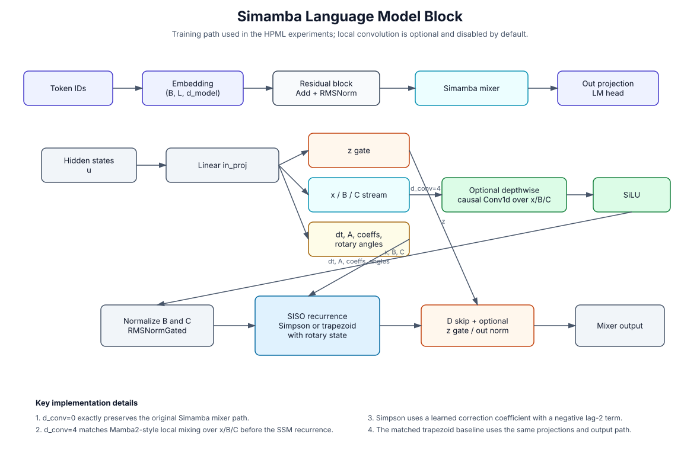

# HPML Simamba Project Report

Date: 2026-05-04

Repository: `hpmls26/simamba`

This document summarizes the end-to-end Simamba HPML project: the model changes relative to the repository's Mamba-3 implementation, data preparation, training loops, evaluation protocol, performance benchmarking, and the experiments we ran on the single V100 machine after the A6000 cluster became unavailable.

## Executive Summary

The project goal was to test whether a Simpson-style discretization can improve over the trapezoidal discretization used by the Mamba-3 SISO kernel. The main implementation adds a `Simamba` mixer that keeps the Mamba-3-style SISO structure but changes the recurrence weights from a width-2 trapezoid update to a width-3 Simpson-inspired update.

The main finding so far is negative but useful:

- The training pipeline is now stable in fp32 on a single V100.
- The current Simpson parameterization does not beat the matched trapezoid baseline on SlimPajama language modeling.
- The true trapezoid Simamba baseline is consistently stronger than default Simpson in the controlled language-model experiments.
- Adding Mamba2-style causal local mixing to Simamba improves the setup for a fair comparison, but the local-conv trapezoid baseline is still ahead of local-conv Simpson at the 50M-token budget.
- Mamba2 is not a clean discretization baseline because it includes a causal depthwise local convolution over the `x/B/C` stream. Shrinking/removing that conv hurts Mamba2, which confirms that local mixing is a real confound.

## Model Architecture



The architecture diagram is generated by:

```bash
.venv/bin/python scripts/generate_simamba_architecture_svg.py
```

The language model is the repository's `MambaLMHeadModel` wrapper:

1. Token IDs are embedded.
2. Each residual block applies add + RMSNorm and then a mixer.
3. The mixer is `Simamba`, `Mamba2`, or other Mamba-family layers selected by `--model-layer`.
4. The final hidden states go through the tied LM head.

For Simamba, the mixer path is:

1. `in_proj(u)` produces `z`, `x`, `B`, `C`, `dt`, `A`, the discretization coefficient, optional midpoint coefficient, and rotary angle parameters.
2. Optional local mixing applies a depthwise causal Conv1d over the concatenated `x/B/C` stream:

```text
xBC = concat(x, B, C)
xBC = SiLU(depthwise_causal_conv1d(xBC))
x, B, C = split(xBC)
```

3. `B` and `C` are normalized with `RMSNormGated`.
4. Rotary state and the SISO recurrence produce the mixer output.
5. The D skip, optional z gate, optional output RMSNorm, and output projection complete the block.

The local convolution is controlled by `--simamba-d-conv`. The default is `0`, which preserves the original no-local-conv Simamba path. The matched Mamba2-style experiments use `--simamba-d-conv 4`.

## Changes From The Mamba-3 Implementation

The repository's Mamba-3 SISO path uses an exponential trapezoidal recurrence. Simamba changes this recurrence to a Simpson-inspired recurrence and adds controls to make the comparison experimentally meaningful.

### Trapezoid Baseline

For a SISO state `S_t`, input outer product `K_t V_t`, decay `alpha_t = exp(A_t * dt_t)`, and learned trapezoid coefficient `p_t`, the matched trapezoid path implemented in `simamba_trapezoid_siso_combined` uses a width-2 update. In simplified form:

```text
gamma_t = dt_t * p_t
scale_t = gamma_t + dt_{t+1} * (1 - p_{t+1})
S_t = alpha_t * S_{t-1} + scale_t * (V_t K_t^T)
```

The exact implementation also includes rotary state, `Q/K` biases, the D skip, optional Z gate, and vectorized causal evaluation for training/eval.

### Simpson-Inspired Update

Simamba uses a width-3 recurrence. Let:

```text
alpha_t      = exp(A_t * dt_t)
alpha_half_t = exp(A_t * dt_t / 2)
s_t          = clamp(sigmoid(control_t) * midpoint_t, 0, 1)
```

When midpoint control is disabled, `midpoint_t = 1`. The update coefficients are:

```text
gamma0_t = dt_t / 6  * (1 + alpha_half_t * (2 - 0.5 * s_t))
gamma1_t = dt_t / 6  * (alpha_t + alpha_half_t * (2 + s_t))
gamma2_t = -dt_t / 12 * alpha_half_t * s_t
```

The state update is:

```text
S_t = alpha_t * S_{t-1}
    + gamma0_t * (V_t     K_t^T)
    + gamma1_t * (V_{t-1} K_{t-1}^T)
    + gamma2_t * (V_{t-2} K_{t-2}^T)
```

The important modeling detail is the negative lag-2 term `gamma2_t`. This is the most likely reason the current Simpson variant has noisier gradients and worse optimization than trapezoid on LM.

### Controls Added During The Project

The following controls were added so the experiments would be interpretable:

- `--simamba-discretization {simpson,trapezoid}`: switches between Simpson and the matched trapezoid baseline.
- `--simamba-control-logit-offset`: shifts the coefficient before sigmoid. We used `-4.0` to initialize the Simpson correction closer to zero.
- `--simamba-midpoint-logit-offset` and `--simamba-use-midpoint-control`: optional midpoint modulation.
- `--simamba-d-conv`: optional Mamba2-style causal local mixing over `x/B/C`.
- Fixed validation sampling and epoch-style train sampling.
- fp32 parameter storage on V100 for SSM stability.
- W&B resume metadata and checkpoint metadata for reliable restarts.

## Dataset Preparation

The data preparation script is `scripts/prepare_slimpajama.py`.

It streams SlimPajama from Hugging Face:

```text
dataset:  MBZUAI-LLM/SlimPajama-627B-DC
config:   default
tokenizer: EleutherAI/gpt-neox-20b
```

Each document is tokenized without extra special tokens, then an EOS token is appended. Tokens are stored as `uint16` memory-mapped `.bin` files because the GPT-NeoX tokenizer vocabulary fits within 16 bits.

Prepared datasets:

| Dataset | Train tokens | Train docs | Validation tokens | Validation docs | Path |
|---|---:|---:|---:|---:|---|
| 100M/10M | 100,000,000 | 52,903 | 10,000,000 | 10,473 | `data/slimpajama_100m_10m` |
| 500M/50M | 500,000,000 | 691,532 | 50,000,000 | 49,451 | `data/slimpajama_500m_50m` |

The 500M/50M dataset used:

```text
seed = 1337
shuffle_buffer = 100000
allowed_sources = all SlimPajama sources
eos_after_each_doc = true
token_dtype = uint16
```

The training script reads these files with `np.memmap`, which avoids loading the full token array into RAM.

## Training Loop

The main training script is `scripts/train_simamba_lm.py`.

Important training loop details:

- Optimizer: AdamW.
- Parameters: fp32 master weights.
- Mixed precision: disabled for the final apples-to-apples runs; `--dtype fp32`.
- LR schedule: linear warmup followed by cosine decay to `--min-lr`.
- Gradient clipping: `--grad-clip 1.0`.
- Nonfinite protection: `--skip-nonfinite-steps --max-nonfinite-skips 1`.
- Training sampling: `--train-sampling epoch`, a shuffled without-replacement pass over non-overlapping token blocks.
- Validation sampling: `--eval-sampling fixed`, deterministic validation spans for comparable curves.
- Checkpoints: `latest`, `best`, and periodic `step_*` checkpoints.
- W&B: run ID and resume metadata are saved with checkpoints.

The 10M-parameter LM shape used for most controlled experiments:

```text
d_model = 160
n_layer = 8
d_state = 64
headdim = 32
seq_len = 128
global_batch_size = 64
micro_batch_size = 8
tokens_per_step = 8192
```

The 50M-token runs use:

```text
max_steps = 6104
warmup_steps = 500
lr = 2e-4
min_lr = 2e-5
eval_every = 500
eval_iters = 200
```

The 500M-token one-pass runs use:

```text
max_steps = 61035
warmup_steps = 1000
lr = 2e-4
min_lr = 2e-5
eval_every = 1000
eval_iters = 500
```

## Evaluation

We used three evaluation types:

1. Fixed-validation language-model loss on SlimPajama.
2. Kernel/runtime benchmarks from `benchmarks/benchmark_simamba_siso.py`.
3. Compression/pruning perturbation eval from `scripts/eval_checkpoint_compression.py`.

Validation loss is the primary model-quality metric in this report. It is measured on fixed token spans so different runs see the same validation batches.

The benchmark harness compares Mamba-3 trapezoid SISO kernels against Simamba SISO kernels on synthetic tensors. The plotting script `benchmarks/plot_simamba_benchmarks.py` encodes benchmark results collected from terminal runs and writes:

- `benchmarks/plots/simamba_latency.png`
- `benchmarks/plots/simamba_throughput.png`
- `benchmarks/plots/simamba_memory.png`
- `benchmarks/plots/simamba_ratio_summary.png`

Fresh V100 benchmark attempt:

```bash
.venv/bin/python benchmarks/benchmark_simamba_siso.py \
  --mode all --batch 1 --prompt-len 128 --gen-len 64 \
  --nheads 8 --headdim-qk 32 --headdim-v 32 \
  --chunk-size 16 --dtype fp16 --warmup 5 --rep 20 \
  --step-rep 50 --e2e-repeats 2
```

This failed in the Mamba-3 side of the benchmark because this V100/Triton environment does not expose `triton.language.make_tensor_descriptor`, which is also why the original Mamba-3 training path could not be used directly on this machine. The failure log is `run_logs/benchmark_simamba_siso_v100_20260504.log`.

## Performance Benchmark Numbers

The following numbers come from the repository benchmark plot script, which stores measured values from `benchmarks/benchmark_simamba_siso.py`.

### Kernel Latency And Throughput

| Benchmark | Metric | Mamba-3 | Simamba | Sim/M3 |
|---|---|---:|---:|---:|
| B1 P128 G64 | prefill ms | 0.0522 | 40.5555 | 776.9x |
| B1 P128 G64 | prefill tok/s | 2,450,980 | 3,156 | 0.0013x |
| B1 P128 G64 | step ms | 0.0063 | 0.0068 | 1.08x |
| B1 P128 G64 | step tok/s | 158,569 | 147,223 | 0.93x |
| B4 P1024 G256 | prefill ms | 0.8602 | 353.3066 | 410.7x |
| B4 P1024 G256 | prefill tok/s | 4,761,905 | 11,593 | 0.0024x |
| B4 P1024 G256 | step ms | 0.0160 | 0.0173 | 1.08x |
| B4 P1024 G256 | step tok/s | 249,674 | 231,760 | 0.93x |
| B4 P1024 G256 | E2E ms | 73.3674 | 442.9353 | 6.04x |
| B4 P1024 G256 | E2E total tok/s | 69,786 | 11,559 | 0.17x |
| B4 P1024 G256 midpoint | E2E ms | 72.4556 | 465.6271 | 6.43x |
| B4 P1024 G256 midpoint | E2E total tok/s | 70,664 | 10,996 | 0.16x |

### Memory

| Benchmark | Metric | Mamba-3 | Simamba | Sim/M3 |
|---|---|---:|---:|---:|
| B1 P128 G64 | prefill peak MB | 5.8833 | 5.9043 | 1.00x |
| B1 P128 G64 | step peak MB | 5.3887 | 5.3965 | 1.00x |
| B4 P1024 G256 | prefill peak MB | 167.3911 | 124.2363 | 0.74x |
| B4 P1024 G256 | step peak MB | 108.1738 | 108.2051 | 1.00x |
| B4 P1024 G256 midpoint | prefill peak MB | 168.0161 | 124.8618 | 0.74x |
| B4 P1024 G256 midpoint | step peak MB | 108.7988 | 108.8306 | 1.00x |

Interpretation:

- The current Simamba prefill kernel is much slower than the Mamba-3 trapezoid kernel.
- Decode-step latency is close, usually within about 8%.
- Simamba prefill memory can be lower in the B4 P1024 benchmark, but this does not compensate for the prefill latency gap.
- For HPML, the most important systems conclusion is that the algorithmic change currently needs kernel work before it is competitive for prefill throughput.

## Training Throughput

Median tail throughput from the last 100 logged training points:

| Run | Median tokens/s |
|---|---:|
| Mamba2 full 500M+500M | 16,095 |
| Simamba Simpson 500M+500M | 12,537 |
| Simamba midpoint 500M+500M | 12,594 |
| Simamba trapezoid 500M | 16,280 |
| Simamba localconv Simpson 50M | 14,374 |
| Simamba localconv Simpson low-control 50M | 14,332 |
| Simamba localconv trapezoid 50M | 15,197 |

The local-conv Simpson variants are slower than trapezoid and Mamba2, but faster than the non-local-conv Simpson continuation runs at the measured tail.

## Experiment 1: Initial Instability And Gradient Explosion

Problem:

- Early runs had exploding gradients before warmup ended.
- Gradient clipping kept the process alive, but the loss plateaued.
- Nonfinite skip counters later confirmed NaN/inf steps in unstable runs.

Actions:

- Switched V100 runs to fp32 parameters and fp32 training.
- Kept AMP-style parameter handling out of the final apples-to-apples runs.
- Added cosine LR decay after warmup instead of only increasing LR.
- Reduced peak LR for unstable larger runs.
- Added `--skip-nonfinite-steps` and explicit logging of grad norm before and after clipping.
- Added W&B resume metadata and reliable checkpoint manifests.

Result:

- The controlled fp32 runs listed below had zero nonfinite skips.
- The pipeline became stable enough to complete repeated 50M and 500M-token experiments.

## Experiment 2: Tiny Overfit And Smoke Tests

Purpose:

- Verify that the train loop, data loader, checkpointing, and W&B logging work on a small subset before starting long runs.

Outcome:

- Small models were able to train without the original nonfinite failure mode.
- A 50M-parameter run was attempted on the V100, but large Triton compile/shared-memory pressure made the smaller 10M shape a better experimental vehicle.

## Experiment 3: 500M-Token Main Comparison

These runs used the 10M-parameter shape and the 500M/50M SlimPajama subset.

| Model | W&B | Best validation loss | Best step | Last validation loss | Last train loss |
|---|---|---:|---:|---:|---:|
| Mamba2 fp32 | https://wandb.ai/ssb2234-columbia/simamba/runs/dm74y180 | 4.8625 | 122000 | 4.8625 | 4.2041 |
| Simamba Simpson fp32 | https://wandb.ai/ssb2234-columbia/simamba/runs/wu8bhcqa | 4.9319 | 89000 | 4.9671 | 4.3852 |
| Simamba midpoint fp32 | https://wandb.ai/ssb2234-columbia/simamba/runs/juxcboyg | 4.9178 | 71000 | 4.9889 | 4.3816 |
| Simamba trapezoid fp32 | https://wandb.ai/ssb2234-columbia/simamba/runs/0rjsv3c1 | 4.9326 | 61000 | 4.9326 | 4.4823 |

Interpretation:

- Mamba2 continued improving through the second pass and is the best model in this table.
- Simpson and midpoint Simpson improved early but then overfit or degraded on validation.
- The matched trapezoid baseline is competitive with Simpson and better than the final Simpson validation loss.
- This table does not support the claim that the current Simpson recurrence is better than trapezoid.

## Experiment 4: Matched 50M-Token Discretization Ablation

This experiment used the same dataset, batch size, schedule, and seed, but only 50M training tokens.

| Model | W&B | Best/final validation loss | Last train loss | Nonfinite skips |
|---|---|---:|---:|---:|
| Simamba trapezoid | https://wandb.ai/ssb2234-columbia/simamba/runs/jgjlc1sr | 5.8195 | 5.6111 | 0 |
| Simamba Simpson default | https://wandb.ai/ssb2234-columbia/simamba/runs/9yuk3voc | 5.9178 | 5.7161 | 0 |
| Simamba Simpson control offset -4 | https://wandb.ai/ssb2234-columbia/simamba/runs/bouk7ayj | 5.8929 | 5.6995 | 0 |

Interpretation:

- Lowering the initial Simpson correction helps.
- The improvement is not enough to beat trapezoid.
- This supports the hypothesis that the negative lag-2 correction makes optimization harder.

## Experiment 5: Mamba2 Local-Convolution Controls

Mamba2 includes a causal depthwise convolution over the `x/B/C` stream. Simamba originally did not. We tested whether this local mixing explains some of the gap.

| Model | W&B | Validation loss | Last train loss | Notes |
|---|---|---:|---:|---|
| Mamba2 `d_conv=2` | https://wandb.ai/ssb2234-columbia/simamba/runs/51azmxt5 | 5.8425 | 5.6268 | Smallest supported fused causal-conv width. |
| Mamba2 `d_conv=1`, no mem-eff path | https://wandb.ai/ssb2234-columbia/simamba/runs/pmb0qyxn | 5.9001 | 5.6958 | True no-temporal-conv control after patching the width-1 path. |
| Mamba2 `d_conv=1`, fused | https://wandb.ai/ssb2234-columbia/simamba/runs/khcjkjyb | n/a | n/a | Invalid: external `causal_conv1d` rejects width 1. |

Interpretation:

- Removing or shrinking local convolution hurts Mamba2.
- Therefore Mamba2 vs Simamba is not a pure discretization comparison.
- A fair Simamba test needs matched local mixing.

## Experiment 6: Local-Convolution Simamba

We added `--simamba-d-conv 4` to match Mamba2-style local mixing over `x/B/C`.

| Model | W&B | Best/final validation loss | Last train loss | Nonfinite skips |
|---|---|---:|---:|---:|
| Simamba localconv trapezoid | https://wandb.ai/ssb2234-columbia/simamba/runs/03okzay6 | 5.8469 | 5.6309 | 0 |
| Simamba localconv Simpson low-control | https://wandb.ai/ssb2234-columbia/simamba/runs/w6u32odi | 5.8793 | 5.6701 | 0 |
| Simamba localconv Simpson default | https://wandb.ai/ssb2234-columbia/simamba/runs/eglr4x75 | 5.8890 | 5.6759 | 0 |

Interpretation:

- Local mixing improves Simpson compared with the no-local-conv default Simpson result.
- Local-conv trapezoid is still better than local-conv Simpson at this budget.
- Low-control Simpson remains better than default Simpson, consistent with the earlier ablation.

## Experiment 7: Synthetic State Tracking

We added `scripts/train_state_tracking.py` to train small Mamba-family classifiers on synthetic tasks such as parity, modular sum, and signed modular sum. The intent was to test whether Simpson's higher-order recurrence helps on algorithmic state-tracking tasks.

Observed result:

- The `mod_sum` Simamba Simpson run did not produce a convincing positive result.
- Final recorded metrics for one Simpson run were approximately `eval/loss_len128 = 2.7811`, `eval/acc_len128 = 0.0508`, `eval/loss_len256 = 2.7805`, and `eval/acc_len256 = 0.0542`.

Interpretation:

- These synthetic results are not currently paper-positive.
- They are useful as diagnostics but should not be the core claim.

## Experiment 8: Compression And Pruning

The script `scripts/eval_checkpoint_compression.py` evaluates non-destructive weight perturbations on fixed validation spans. It does not provide optimized int8 or sparse kernels; it only measures validation degradation after quantize-dequantize or pruning.

Fixed eval:

```text
200 batches x 8 examples x 128 tokens
eval_seed = 20261504
```

| Checkpoint | Baseline | int8 row qdq delta | int4 row qdq delta | 10% prune delta | 20% prune delta | 30% prune delta |
|---|---:|---:|---:|---:|---:|---:|
| Mamba2 best | 4.8740 | +0.0019 | +0.5181 | +0.0457 | +0.4238 | +1.4881 |
| Simamba midpoint best | 4.9178 | +0.0014 | +0.5846 | +0.0433 | +0.4443 | +1.2446 |
| Simamba trapezoid best | 4.9411 | +0.0013 | +0.3771 | +0.0207 | +0.1750 | +0.6680 |

Interpretation:

- Row-wise int8 quantize-dequantize is nearly lossless.
- Int4 and unstructured pruning beyond 10% are too damaging without finetuning.
- Compression is a useful HPML side result, but it does not explain the discretization gap.

## Code Artifacts Added Or Modified

Important files:

- `mamba_ssm/modules/simamba.py`: Simamba mixer, Simpson/trapezoid selection, coefficient offsets, local convolution.
- `mamba_ssm/ops/triton/simamba/simamba_siso_combined.py`: reference/vectorized Simamba and matched trapezoid SISO paths.
- `scripts/train_simamba_lm.py`: training loop, fixed validation, epoch sampling, LR decay, W&B/checkpointing, Simamba CLI flags.
- `scripts/prepare_slimpajama.py`: streaming SlimPajama tokenization.
- `scripts/train_state_tracking.py`: synthetic state-tracking classifier training.
- `scripts/eval_checkpoint_compression.py`: pruning/quantization perturbation eval.
- `scripts/run_simamba_localconv_50m.sh`: matched local-conv Simamba experiment launcher.
- `scripts/generate_simamba_architecture_svg.py`: architecture figure generator.
- `benchmarks/benchmark_simamba_siso.py`: SISO kernel benchmark harness.
- `benchmarks/plot_simamba_benchmarks.py`: benchmark plot generator.

## Conclusions

The current project produced a stable single-GPU training and evaluation pipeline and a set of controlled ablations. The central scientific result is that the present Simpson discretization does not yet outperform trapezoid on the language-modeling experiments. The strongest evidence points to the learned negative lag-2 Simpson term as the likely optimization issue.

For a final HPML presentation, the honest story is:

1. We implemented Simpson-style SISO dynamics and matched trapezoid baselines.
2. We fixed the training loop and data pipeline enough to run stable controlled experiments on one V100.
3. We showed that Mamba2's local convolution is a confound and added matched local mixing to Simamba.
4. The matched local-conv trapezoid baseline remains ahead, so the current Simpson formulation is not yet a win.
5. Systems benchmarking shows decode-step overhead is small, but prefill is much slower for Simamba and needs kernel optimization.

## Next Work

The highest-value next changes are:

- Reparameterize or anneal the Simpson correction so the negative lag-2 term cannot dominate early training.
- Build a fused local-conv Simamba kernel rather than using PyTorch Conv1d plus the existing SISO path.
- Run multi-seed 50M-token comparisons only after a single-seed Simpson variant beats the matched trapezoid baseline.
- Add a V100-compatible fallback benchmark mode that bypasses Mamba-3 kernels requiring `tl.make_tensor_descriptor`.
